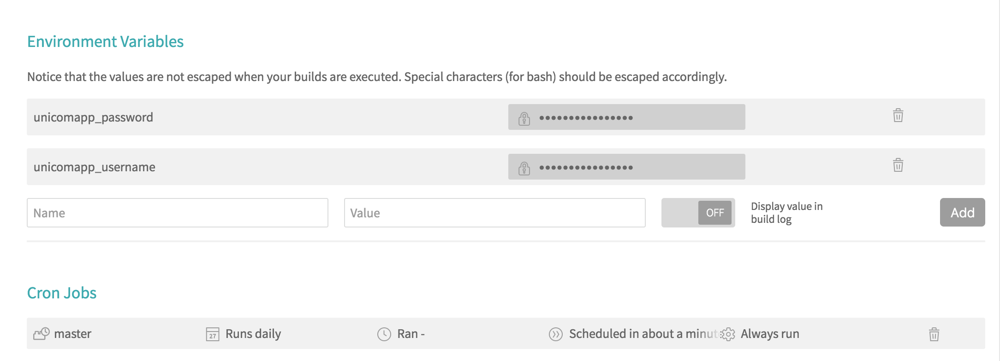

## simple sign in

简单的自动签到，通常用于可以根据用户名和密码就可以进行登录和签到的场景，便于自动化，涉及js加载校验和验证码识别的，可另寻其他方法。

自动化的签到是利用travis-ci完成的，这种方式不需要单独购买vps维护。

## Usage

* fork this project

* 注册travis-ci, 然后加入project

* 设置环境变量和运行计划

## support

* unicom app(中国联通手机营业厅)
